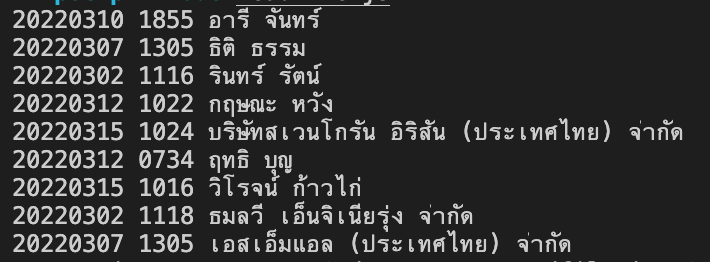

## BACKEND EXAM

**1. ให้สร้าง function ชื่อ setStringHdp โดยการรับค่า number ให้ return ออกมาเป็น string ค่าตามตัวอย่าง**

    input 0 --> output 0
    input 1 --> output 1.0
    input 2 --> output 2.0
    input 1.25 --> output 1/1.5
    input 1.5 --> output 1.5
    input 1.75 --> output 1.5/2
    input 2.75 --> output 2.5/3
    input -3.25 --> output -3/3.5

**2. ให้สร้าง api ชื่อ merge-market ให้ใช้ express js โดยการให้นำ key ที่ชื่อ markets ของ url SBO มาใส่ใน BR โดยต้องเรียง leagueName ตาม SBO ต้องได้ผลลัพท์ตาม url ข้างล่าง**
    
#### SBO
https://artemis-exam.secure-restapi.com/sbo
#### BR
https://artemis-exam.secure-restapi.com/br

#### Result
https://artemis-exam.secure-restapi.com/result

**3. ให้อ่านไฟล์ข้อมูลตามตัวอย่างให้ได้ output ออกมาตามภาพ**

#### FILE
[Download here](./example.txt)

 #### Ouput

